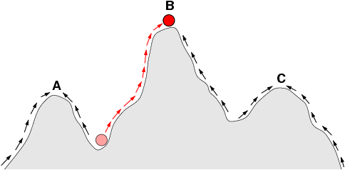
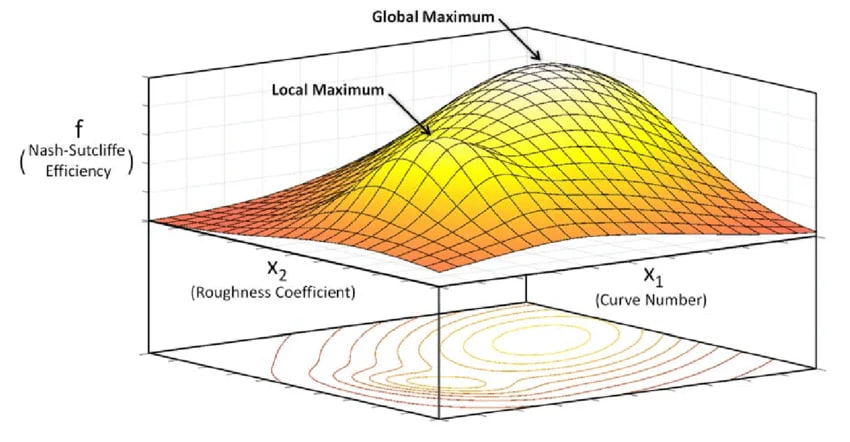

---
## Front matter
title: "Доклад"
subtitle: "Перспектива и инновация"
author: "Иванов Сергей Владимирович, НПИбд-01-23"

## Generic otions
lang: ru-RU
toc-title: "Содержание"

## Bibliography
bibliography: bib/cite.bib
csl: pandoc/csl/gost-r-7-0-5-2008-numeric.csl

## Pdf output format
toc: true # Table of contents
toc-depth: 2
lof: true # List of figures
fontsize: 12pt
linestretch: 1.5
papersize: a4
documentclass: scrreprt
## I18n polyglossia
polyglossia-lang:
  name: russian
  options:
	- spelling=modern
	- babelshorthands=true
polyglossia-otherlangs:
  name: english
## I18n babel
babel-lang: russian
babel-otherlangs: english
## Fonts
mainfont: PT Serif
romanfont: PT Serif
sansfont: PT Sans
monofont: PT Mono
mainfontoptions: Ligatures=TeX,Scale=0.94
romanfontoptions: Ligatures=TeX,Scale=0.94
sansfontoptions: Ligatures=TeX,Scale=MatchLowercase,Scale=0.94
monofontoptions: Scale=MatchLowercase,Scale=0.94,FakeStretch=0.9
## Biblatex
biblatex: true
biblio-style: "gost-numeric"
biblatexoptions:
  - parentracker=true
  - backend=biber
  - hyperref=auto
  - language=auto
  - autolang=other*
  - citestyle=gost-numeric
## Pandoc-crossref LaTeX customization
figureTitle: "Рис."
listingTitle: "Листинг"
lofTitle: "Список иллюстраций"
lolTitle: "Листинги"
## Misc options
indent: true
header-includes:
  - \usepackage{indentfirst}
  - \usepackage{float} # keep figures where there are in the text
  - \floatplacement{figure}{H} # keep figures where there are in the text
---

# Введение

В современном мире сложность решаемых задач — от логистики и инженерного проектирования до управления государством — растет экспоненциально. Традиционные методы интуитивного принятия решений уступают место математическому моделированию. Математическая модель позволяет формализовать проблему, выделить ключевые переменные и найти оптимальный путь к цели. Однако успех моделирования зависит не только от вычислительной мощности компьютеров, но и от того, как именно мы смотрим на проблему.

В данном докладе рассматриваются два фундаментальных понятия математического моделирования в контексте теории коллективного разума и оптимизации: **перспектива** и **инновация**. Мы разберем, как формальное определение перспективы влияет на поиск решений, почему возникают локальные максимумы и как теорема Саванта обосновывает возможность существования идеального взгляда на любую задачу.

# Понятие перспективы в математическом моделировании

## Определение и формализация

Согласно определению, предложенному в рамках современной теории системного анализа, **перспектива** — это представление множества всех возможных решений данной проблемы. Если говорить математическим языком, перспектива представляет собой способ кодирования потенциальных решений.

Представим задачу как некоторое пространство состояний. Решение проблемы — это поиск точки в этом пространстве, которая соответствует наилучшему результату. Однако само пространство не дано нам в чистом виде. Чтобы увидеть его, мы должны его интерпретировать.

Перспектива включает в себя:

1. **Множество объектов (решений):** все варианты действий, которые мы можем предпринять.
2. **Способ отображения:** как эти решения соотносятся друг с другом.

Например, если наша задача — найти кратчайший путь между городами, одна перспектива может рассматривать их как точки на плоскости (геометрический подход), а другая — как узлы в графе с весами-затратами времени (топологический подход).

## Зависимость перспективы от проблемы

Важно понимать, что перспектива не существует сама по себе — она жестко привязана к проблеме. Одна и та же перспектива может быть идеальной для задачи планирования бюджета и абсолютно бесполезной для дизайна аэродинамического крыла.

Когда мы выбираем перспективу, мы фактически создаем «ландшафт» задачи. На этом ландшафте по одной оси располагаются возможные решения, а по другой — их эффективность (значение целевой функции). Таким образом, выбор перспективы определяет рельеф этого ландшафта: будет ли он пологим, холмистым или состоящим из острых пиков.

# Ландшафты и локальные оптимумы

## Понятие локального оптимума

В процессе математического поиска решений (оптимизации) мы стремимся найти самую высокую точку ландшафта — **глобальный оптимум**. Однако большинство сложных задач создают «изрезанные» ландшафты.

**Локальный оптимум** — это такое решение, которое лучше всех своих «соседей» в данной перспективе, но не является наилучшим в принципе. Главная проблема моделирования заключается в том, что алгоритмы (и люди) часто «застревают» в локальных оптимумах. Если вы находитесь на вершине небольшого холма, любой шаг в любую сторону приведет к ухудшению результата. С точки зрения текущей перспективы кажется, что решение найдено, хотя за глубокой долиной может находиться настоящая гора — гораздо более эффективное решение. 

{#fig:001 width=70%}

## Наилучшая перспектива

Наилучшая перспектива имеет наилучший локальный оптимум. Это означает, что качество нашего моделирования напрямую зависит от того, насколько близко самый высокий пик, который мы можем «увидеть» и достичь в текущем представлении, находится к абсолютному пределу возможностей.

Если наша текущая модель (перспектива) дает нам локальные максимумы, которые нас не устраивают, это сигнал к тому, что нужно не «улучшать» текущее решение, а менять саму перспективу — способ представления задачи.

# Теорема Саванта о перспективах

Центральное место в теории моделирования решений занимает теорема Саванта.

## Формулировка теоремы

**Теорема гласит:** для любой проблемы существует такая перспектива, которая создает «ландшафт» с одним-единственным экстремумом.

Это утверждение гласит о том, что какой бы сложной ни казалась задача (будь то поиск лекарства или управление пробками в мегаполисе), теоретически существует такой способ взглянуть на эту задачу, при котором путь к глобальному оптимуму будет прямым и лишенным ловушек в виде локальных пиков.

## Математический смысл

В ландшафте с одним экстремумом любая стратегия восхождения неизбежно приведет к вершине. Здесь нет тупиков.

Доказательство существования такой перспективы опирается на возможность перенумерации или перекодирования множества решений. Если мы заранее знаем ответ (глобальный оптимум), мы можем выстроить все остальные решения в ряд по мере убывания их эффективности. В такой искусственно созданной перспективе решение станет тривиальным.

## Почему это сложно на практике?

Хотя теорема Саванта гарантирует существование такой перспективы, она не дает алгоритма ее поиска. Зачастую поиск идеальной перспективы оказывается сложнее, чем решение самой задачи в плохой перспективе. Однако само знание того, что такая точка зрения существует, стимулирует инновационную деятельность.

{#fig:002 width=70%}

# Инновация как смена перспективы

В контексте математического моделирования **инновация** — это не просто незначительное улучшение существующего процесса, а обнаружение новой перспективы, которая устраняет существующие локальные оптимумы.

## Эволюция против инновации

Обычная оптимизация (эволюция модели) — это подъем вверх по склону текущего холма. Инновация — это «прыжок» на другой склон или полная перестройка ландшафта.

Когда математик или аналитик сталкивается с тем, что модель перестает давать прирост эффективности, он совершает инновационный акт: меняет систему координат. Например, переход от классической механики к квантовой в физике был сменой перспективы, которая позволила решить задачи, бывшие тупиковыми для ученых XIX века.

## Разнообразие перспектив

Математическое моделирование коллективного решения задач показывает, что группа людей с разными перспективами (даже если каждый из них по отдельности не является гением) справляется с задачей лучше, чем один эксперт с одной очень хорошей перспективой. Это происходит потому, что локальный оптимум для одного человека может не быть таковым для другого. Там, где один застрял на холме, другой видит склон, ведущий выше.

# Область применения: принятие решений

Основная область применения данных концепций — теория принятия решений. Математические модели, основанные на перспективах, используются в следующих сферах:

1. **Бизнес и менеджмент:** при разработке новых продуктов компании используют метод мозгового штурма именно для поиска новых перспектив на рынок. Математическое моделирование потребительского поведения позволяет выявить скрытые потребности, которые не были видны в старой парадигме.

2. **Экономическое прогнозирование:** использование различных моделей позволяет лицам, принимающим решения, видеть разные ландшафты рисков.

3. **Искусственный интеллект и машинное обучение:** обучение нейросетей — это по сути поиск глобального минимума функции потерь. Инновации в архитектурах сетей (например, переход от полносвязных сетей к трансформерам) — это реализация теоремы Саванта на практике: создание ландшафтов, в которых обучение происходит эффективнее.

4. **Государственное управление:** сложные социальные реформы требуют моделирования последствий. Если реформа буксует, это часто означает, что власти застряли в локальном оптимуме, и требуется инновационный взгляд на структуру общества.

# Заключение

Математическое моделирование — это не только сухие расчеты, но и глубокая философская работа по выбору точки обзора. Понимание того, что такое перспектива, позволяет нам осознанно подходить к поиску решений, избегая ловушек локальных максимумов.

Теорема Саванта дает нам оптимистичный фундамент: для любой проблемы есть решение, которое выглядит очевидным в правильной перспективе. Инновация в моделировании — это и есть поиск этого идеального взгляда. Таким образом, успех в принятии решений зависит от нашей способности постоянно пересматривать свои модели, комбинировать различные перспективы и стремиться к созданию ландшафтов с единственным, глобальным экстремумом.

# Источники

1. Математическое моделирование. Обзор методов и подходов к созданию моделей. https://ru.wikipedia.org/wiki/Математическое_моделирование

2. Оптимизация (математика). Описание локальных и глобальных экстремумов. https://ru.wikipedia.org/wiki/Оптимизация_(математика)

3. Теория принятия решений. Математические основы выбора наилучших вариантов. https://ru.wikipedia.org/wiki/Теория_принятия_решений

4. What is optimization modeling? https://www.ibm.com/think/topics/optimization-model 

5. Математическое моделирование может увеличивать производительность в 3 раза https://habr.com/ru/articles/808757/ 

6. «Мы создаем мир»: как математическое моделирование помогает производствам, медицине и финансовым рынкам https://abiturient.tpu.ru/news/my-sozdaem-mir-kak-matematiceskoe-modelirovanie-pomogaet-proizvodstvam-medicine-i-finansovym-rynkam 