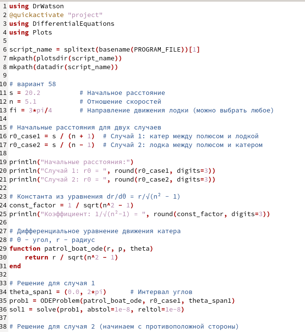

---
## Front matter
lang: ru-RU
title: Лабораторная работа №2
subtitle: Математическое моделирование 
author:
  - Иванов Сергей Владимирович, НПИбд-01-23
institute:
  - Российский университет дружбы народов, Москва, Россия
date: 03 марта 2026

## i18n babel
babel-lang: russian
babel-otherlangs: english

## Formatting pdf
toc: false
slide_level: 2
aspectratio: 169
section-titles: true
theme: metropolis
header-includes:
 - \metroset{progressbar=frametitle,sectionpage=progressbar,numbering=fraction}
 - '\makeatletter'
 - '\beamer@ignorenonframefalse'
 - '\makeatother'

 ## Fonts
mainfont: PT Serif
romanfont: PT Serif
sansfont: PT Sans
monofont: PT Mono
mainfontoptions: Ligatures=TeX
romanfontoptions: Ligatures=TeX
sansfontoptions: Ligatures=TeX,Scale=MatchLowercase
monofontoptions: Scale=MatchLowercase,Scale=0.9
---

# Вводная часть

## Цель работы

Целью лабораторной работы является решение задачи о погоне. Вывод дифференциального уравнения и
моделирование траектории движения катера и лодки.

## Задание

1. Запишите уравнение, описывающее движение катера, с начальными
условиями для двух случаев (в зависимости от расположения катера
относительно лодки в начальный момент времени).

2. Постройте траекторию движения катера и лодки для двух случаев.

3. Найдите точку пересечения траектории катера и лодки.

# Выполнение лабораторной работы

## Рассчет варианта

Номер студенческого билета: 1132236127. Рассчитаем вариант: 1132236127 mod 70 + 1 = 58. Значит, делаю вариант 58.

## Программный код

{#fig-001 width=70%}

## Просмотр графиков

{#fig-002 width=70%}

# Подведение итогов

## Выводы

В результате выполнения лабораторной мы решили задачу о погоне. Вывели дифференциальное уравнение и
смоделировали траектории движения катера и лодки.

