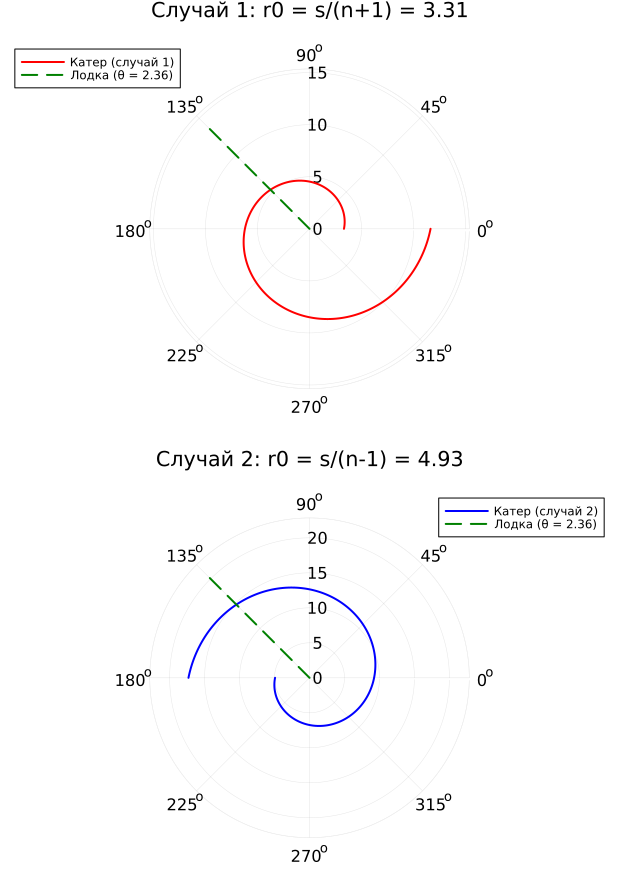

---
## Author
author: Иванов Сергей Владимирович, НПИбд-01-23

## Title
title: "Отчёт по лабораторной работе №2"
subtitle: "Дисциплина: Математическое моделирование"
license: "CC BY"
---

# Цель работы

Целью лабораторной работы является решение задачи о погоне. Вывод дифференциального уравнения и
моделирование траектории движения катера и лодки.

# Задание

1. Запишите уравнение, описывающее движение катера, с начальными
условиями для двух случаев (в зависимости от расположения катера
относительно лодки в начальный момент времени).

2. Постройте траекторию движения катера и лодки для двух случаев.

3. Найдите точку пересечения траектории катера и лодки.

# Выполнение лабораторной работы

Номер студенческого билета: 1132236127. Рассчитаем вариант: 1132236127 mod 70 + 1 = 58. Значит, делаю вариант 58.

## Вывод дифференциальных уравнений движения катера

# Вывод дифференциальных уравнений движения катера (вариант 58)

**Дано:**  
$k = 20.2$ км — начальное расстояние между катером и лодкой,  
$n = 5.1$ — отношение скоростей ($v_{\text{катера}} = n \cdot v$).

**1. Начальные расстояния для перехода к движению вокруг полюса**

Из равенства времён движения до момента, когда катер и лодка окажутся на одинаковом расстоянии $x$ от полюса:

- **Случай 1** (катер между полюсом и лодкой):  
  $\displaystyle \frac{x}{v} = \frac{k - x}{n v} \;\Rightarrow\; x = \frac{k}{n+1}$

- **Случай 2** (лодка между полюсом и катером):  
  $\displaystyle \frac{x}{v} = \frac{x + k}{n v} \;\Rightarrow\; x = \frac{k}{n-1}$

Таким образом, начальные расстояния (после прямолинейного участка):
$$r_{01} = \frac{k}{n+1}, \qquad r_{02} = \frac{k}{n-1}.$$

Для варианта 58:
$$r_{01} = \frac{20.2}{6.1} \approx 3.311\ \text{км}, \quad r_{02} = \frac{20.2}{4.1} \approx 4.927\ \text{км}.$$

**2. Разложение скорости катера**

В полярных координатах скорость катера раскладывается на радиальную $v_r = \dfrac{dr}{dt}$ и тангенциальную $v_\tau = r\dfrac{d\theta}{dt}$ составляющие.  
Модуль полной скорости: $v_k = n v$.

Чтобы катер всё время находился на одном расстоянии с лодкой, радиальная скорость должна равняться скорости лодки:
$$\frac{dr}{dt} = v.$$

Тогда из теоремы Пифагора:
$$(n v)^2 = v^2 + v_\tau^2 \;\Rightarrow\; v_\tau = v\sqrt{n^2 - 1}.$$

С другой стороны, $v_\tau = r\dfrac{d\theta}{dt}$. Приравниваем:
$$r\frac{d\theta}{dt} = v\sqrt{n^2 - 1}.$$

**3. Исключение времени**

Из $\dfrac{dr}{dt}=v$ имеем $dt = \dfrac{dr}{v}$. Подставляем:
$$r\frac{d\theta}{dr/v} = v\sqrt{n^2 - 1} \;\Rightarrow\; r\frac{d\theta}{dr} = \sqrt{n^2 - 1}.$$

Отсюда получаем дифференциальное уравнение траектории катера в полярных координатах:
$$\boxed{\frac{dr}{d\theta} = \frac{r}{\sqrt{n^2 - 1}}}.$$

**4. Начальные условия**

- **Случай 1:** $r(0) = r_{01}$, $\theta_0 = 0$.
- **Случай 2:** $r(-\pi) = r_{02}$, $\theta_0 = -\pi$.

**5. Аналитическое решение**

Интегрируем уравнение:
$$\int \frac{dr}{r} = \int \frac{d\theta}{\sqrt{n^2 - 1}} \;\Rightarrow\; \ln r = \frac{\theta}{\sqrt{n^2 - 1}} + C.$$

С учётом начальных условий:

- Случай 1: $\displaystyle r(\theta) = r_{01}\exp\left(\frac{\theta}{\sqrt{n^2 - 1}}\right)$.
- Случай 2: $\displaystyle r(\theta) = r_{02}\exp\left(\frac{\theta + \pi}{\sqrt{n^2 - 1}}\right)$.

$\sqrt{n^2 - 1} = \sqrt{5.1^2 - 1} = \sqrt{25.01} \approx 5.001$.

## Программный код 

Напишем код для реализации модели. (рис. 1)

```julia
using DrWatson
@quickactivate "project" 
using DifferentialEquations
using Plots

script_name = splitext(basename(PROGRAM_FILE))[1]
mkpath(plotsdir(script_name))
mkpath(datadir(script_name))

# вариант 58
s = 20.2           
n = 5.1           
fi = 3*pi/4      

r0_case1 = s / (n + 1)  # Случай 1: катер между полюсом и лодкой
r0_case2 = s / (n - 1)  # Случай 2: лодка между полюсом и катером

println("Начальные расстояния:")
println("Случай 1: r0 = ", round(r0_case1, digits=3))
println("Случай 2: r0 = ", round(r0_case2, digits=3))

# Константа из уравнения dr/dθ = r/√(n² - 1)
const_factor = 1 / sqrt(n^2 - 1)
println("Коэффициент: 1/√(n²-1) = ", round(const_factor, digits=3))

# Дифференциальное уравнение движения катера
# θ - угол, r - радиус
function patrol_boat_ode(r, p, theta)
    return r / sqrt(n^2 - 1)
end

# Решение для случая 1
theta_span1 = (0.0, 2*pi)      # Интервал углов
prob1 = ODEProblem(patrol_boat_ode, r0_case1, theta_span1)
sol1 = solve(prob1, abstol=1e-8, reltol=1e-8)

# Решение для случая 2 (начинаем с противоположной стороны)
theta_span2 = (-pi, pi)         # Интервал углов
prob2 = ODEProblem(patrol_boat_ode, r0_case2, theta_span2)
sol2 = solve(prob2, abstol=1e-8, reltol=1e-8)

# Движение лодки (прямолинейно под углом fi)
boat_x(t) = t * tan(fi)         # Параметрическое уравнение лодки
# В полярных координатах лодка движется по лучу r = v·t, θ = fi
# Для графика нам нужна прямая линия под углом fi

# Построение графиков
# Случай 1
p1 = plot(sol1, proj=:polar, 
          label="Катер (случай 1)", 
          title="Случай 1: r0 = s/(n+1) = $(round(r0_case1, digits=2))",
          c=:red, lw=2, 
          xlabel="Угол θ", ylabel="Радиус r")

# Добавляем траекторию лодки (луч под углом fi)
# Для отображения лодки в полярных координатах построим луч
theta_boat = range(0, 2*pi, length=100)
r_boat = range(0, maximum(sol1.u)*1.2, length=100)

# Создаем массив точек для луча
boat_r = [r for r in r_boat]
boat_theta = [fi for _ in r_boat]
plot!(p1, boat_theta, boat_r, proj=:polar,
      label="Лодка (θ = $(round(fi, digits=2)))", 
      c=:green, lw=2, linestyle=:dash)

# Случай 2
p2 = plot(sol2, proj=:polar, 
          label="Катер (случай 2)", 
          title="Случай 2: r0 = s/(n-1) = $(round(r0_case2, digits=2))",
          c=:blue, lw=2,
          xlabel="Угол θ", ylabel="Радиус r")

# Добавляем траекторию лодки
boat_r2 = [r for r in range(0, maximum(sol2.u)*1.2, length=100)]
boat_theta2 = [fi for _ in boat_r2]
plot!(p2, boat_theta2, boat_r2, proj=:polar,
      label="Лодка (θ = $(round(fi, digits=2)))", 
      c=:green, lw=2, linestyle=:dash)

plot(p1, p2, layout=(2, 1), size=(700, 900))
savefig(plotsdir(script_name, "lab02.png"))

# Находим точку пересечения
# Для случая 1: катер догонит лодку, когда θ = fi и r совпадут
# В этот момент r_boat = v·t, а r_catcher из решения уравнения

println("Катер догонит лодку, когда его траектория пересечет луч лодки (θ = fi)")
println("Для случая 1: точка пересечения при θ = $fi")
println("Для случая 2: точка пересечения также при θ = $fi")
println("Радиус в точке встречи можно найти из уравнения r(θ) = r0·exp(θ/√(n²-1))")
```

{#fig-001 width=70%}

Также просмотрим как выглядят полученные графики. (рис. 2)

{#fig-002 width=70%}

# Вывод 

В результате выполнения лабораторной мы решили задачу о погоне. Вывели дифференциальное уравнение и
смоделировали траектории движения катера и лодки.
