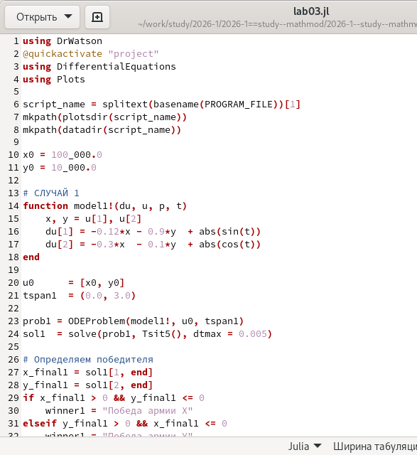
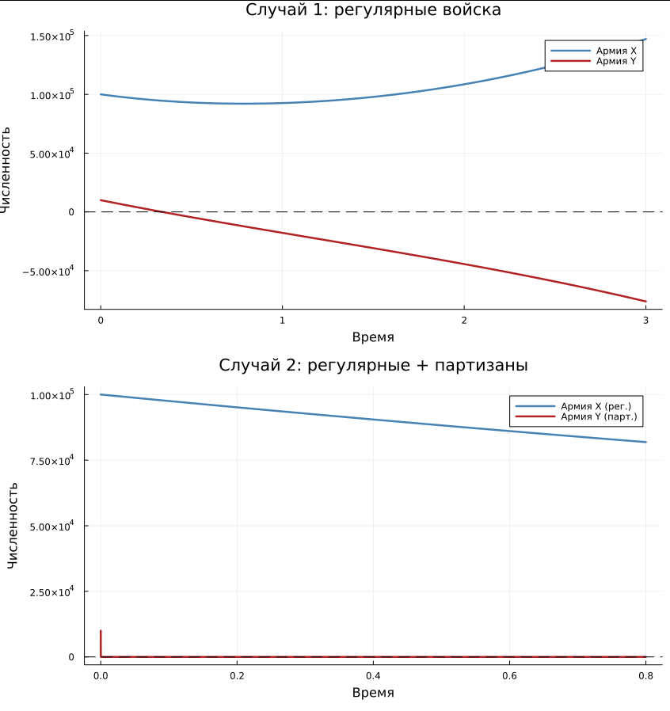

---
## Author
author: Иванов Сергей Владимирович, НПИбд-01-23

## Title
title: "Отчёт по лабораторной работе №3"
subtitle: "Дисциплина: Математическое моделирование"
license: "CC BY"
---

# Цель работы

Целью лабораторной работы является реализовать модель боевых действий Ланчестера для двух случаев - противостояния регулярных 
войск и боя с участием партизанских отрядов, путем решения систем ОДУ и построения графиков изменения численности армий. 

# Задание

1. Построить графики изменения численности войск армии Х и армии У.

# Выполнение лабораторной работы

Номер студенческого билета: 1132236127. Рассчитаем вариант: 1132236127 mod 70 + 1 = 58. Значит, делаю вариант 58.

## Математическая модель

Пусть $x(t)$ — численность армии страны $X$, а $y(t)$ — численность армии страны $Y$, где $t$ — время, отсчитываемое с начала военного конфликта. Производные $\frac{dx}{dt}$ и $\frac{dy}{dt}$ описывают скорости изменения численности армий в каждый момент времени.

На динамику численности войск оказывают влияние три ключевых составляющих:

1. **Небоевые потери** — убыль, не связанная непосредственно с боевыми столкновениями (болезни, дезертирство, несчастные случаи). Задаются коэффициентами $a$ и $h$ соответственно для армий $X$ и $Y$.

2. **Боевые потери** — потери, обусловленные непосредственным противоборством сторон. Определяются коэффициентами боевой эффективности $b$ и $c$.

3. **Подкрепление** — поступление свежих сил, задаваемое функциями $P(t)$ и $Q(t)$.

Начальные условия для варианта 58: $x(0) = 100\,000$, $y(0) = 10\,000$.

### Модель боевых действий между регулярными войсками

При столкновении двух регулярных армий на открытой местности боевые потери каждой из сторон пропорциональны численности армии противника: чем больше численность вражеских войск, тем выше их суммарная огневая мощь и, следовательно, тем интенсивнее потери.

Для варианта 58 система дифференциальных уравнений принимает следующий вид:

$$
\begin{cases}
\dfrac{dx}{dt} = -0{,}12\,x(t) - 0{,}9\,y(t) + |\sin(t)| \\[8pt]
\dfrac{dy}{dt} = -0{,}3\,x(t) - 0{,}1\,y(t) + |\cos(t)|
\end{cases}
$$

Где:
* $-0{,}12\,x(t)$ и $-0{,}1\,y(t)$ — небоевые потери армий $X$ и $Y$ соответственно;
* $-0{,}9\,y(t)$ и $-0{,}3\,x(t)$ — боевые потери, зависящие исключительно от численности противника;
* $|\sin(t)|$ и $|\cos(t)|$ — функции подкрепления $P(t)$ и $Q(t)$.

### Модель боевых действий с участием регулярных войск и партизанских отрядов

В данном случае армия $X$ выступает как регулярные войска, тогда как армия $Y$ действует по партизанской тактике. Поскольку партизаны рассредоточены на местности и не образуют чётко выраженных целей, регулярная армия вынуждена вести огонь по площадям. В таких условиях боевые потери партизан определяются не только численностью регулярной армии, но и плотностью (численностью) самих партизан — то есть пропорциональны произведению $x(t) \cdot y(t)$.

Для варианта 58 система принимает вид:

$$
\begin{cases}
\dfrac{dx}{dt} = -0{,}25\,x(t) - 0{,}96\,y(t) + \sin(2t) + 1 \\[8pt]
\dfrac{dy}{dt} = -0{,}25\,x(t)\,y(t) - 0{,}3\,y(t) + \cos(20t) + 1
\end{cases}
$$

Где член $-0{,}25\,x(t)\,y(t)$ отражает специфику потерь партизанского формирования от действий регулярных войск, вынужденных применять тактику стрельбы по площадям.

## Программный код 

Напишем код для реализации модели. (рис. 1)

```julia
using DrWatson
@quickactivate "project" 
using DifferentialEquations
using Plots

script_name = splitext(basename(PROGRAM_FILE))[1]
mkpath(plotsdir(script_name))
mkpath(datadir(script_name))

x0 = 100_000.0
y0 = 10_000.0
 
# СЛУЧАЙ 1
function model1!(du, u, p, t)
    x, y = u[1], u[2]
    du[1] = -0.12*x - 0.9*y  + abs(sin(t))
    du[2] = -0.3*x  - 0.1*y  + abs(cos(t))
end
 
u0      = [x0, y0]
tspan1  = (0.0, 3.0)
 
prob1 = ODEProblem(model1!, u0, tspan1)
sol1  = solve(prob1, Tsit5(), dtmax = 0.005)
 
# Определяем победителя
x_final1 = sol1[1, end]
y_final1 = sol1[2, end]
if x_final1 > 0 && y_final1 <= 0
    winner1 = "Победа армии X"
elseif y_final1 > 0 && x_final1 <= 0
    winner1 = "Победа армии Y"
else
    winner1 = x_final1 > y_final1 ? "Преимущество у армии X" : "Преимущество у армии Y"
end
 
println("Случай 1 — Регулярные войска:")
println("  X(конец) ≈ $(round(x_final1, digits=1))")
println("  Y(конец) ≈ $(round(y_final1, digits=1))")
println("  $winner1\n")
 
p1 = plot(
    sol1.t, sol1[1, :],
    label  = "Армия X",
    color  = :steelblue,
    lw     = 2.5,
    title  = "Случай 1: регулярные войска",
    xlabel = "Время",
    ylabel = "Численность",
    legend = :topright
)
plot!(p1, sol1.t, sol1[2, :], label = "Армия Y", color = :firebrick, lw = 2.5)
hline!(p1, [0], color = :black, linestyle = :dash, label = "")
 

# СЛУЧАЙ 2
function model2!(du, u, p, t)
    x, y = u[1], u[2]
    du[1] = -0.25*x        - 0.96*y      + sin(2*t)  + 1.0
    du[2] = -0.25*x*y      - 0.3*y       + cos(20*t) + 1.0
end
 
tspan2 = (0.0, 0.8)   
 
prob2 = ODEProblem(model2!, u0, tspan2)
sol2  = solve(prob2, Tsit5(), dtmax = 0.001)
 
x_final2 = sol2[1, end]
y_final2 = sol2[2, end]
if x_final2 > 0 && y_final2 <= 0
    winner2 = "Победа армии X"
elseif y_final2 > 0 && x_final2 <= 0
    winner2 = "Победа армии Y"
else
    winner2 = x_final2 > y_final2 ? "Преимущество у армии X" : "Преимущество у армии Y"
end
 
println("Случай 2 — Регулярные войска + партизаны:")
println("  X(конец) ≈ $(round(x_final2, digits=1))")
println("  Y(конец) ≈ $(round(y_final2, digits=1))")
println("  $winner2\n")
 
p2 = plot(
    sol2.t, sol2[1, :],
    label  = "Армия X (рег.)",
    color  = :steelblue,
    lw     = 2.5,
    title  = "Случай 2: регулярные + партизаны",
    xlabel = "Время",
    ylabel = "Численность",
    legend = :topright
)
plot!(p2, sol2.t, sol2[2, :], label = "Армия Y (парт.)", color = :firebrick, lw = 2.5)
hline!(p2, [0], color = :black, linestyle = :dash, label = "")
 
# Сохранение
combined = plot(p1, p2, layout = (2, 1), size = (850, 900))
savefig(plotsdir(script_name, "lab03.png"))
println("Графики сохранены: lab03_var58.png")
```

{#fig-001 width=70%}

Также просмотрим как выглядят полученные графики. (рис. 2)

{#fig-002 width=70%}

# Вывод 

В результате выполнения лабораторной работы реализована реализовать модель боевых действий Ланчестера для двух случаев - противостояния регулярных 
войск и боя с участием партизанских отрядов, и построены графики изменения численности армий. 
