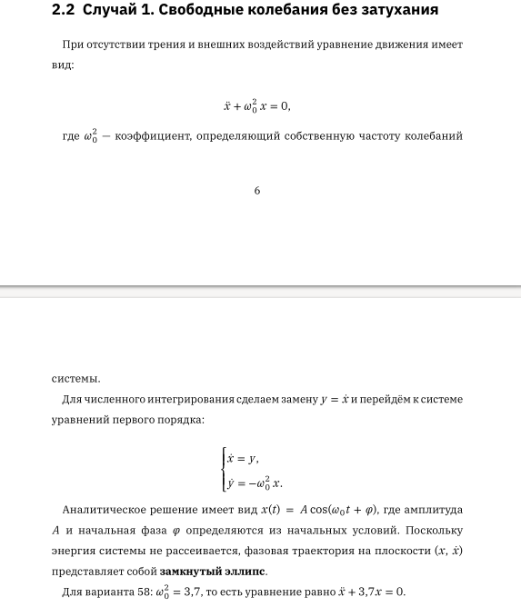
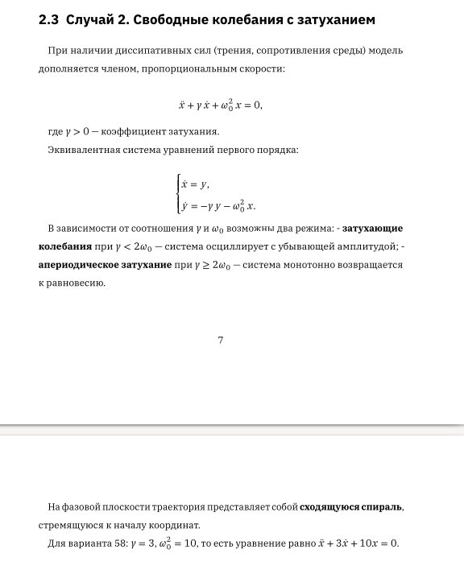
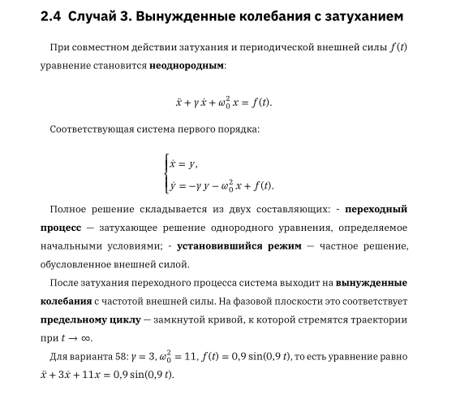
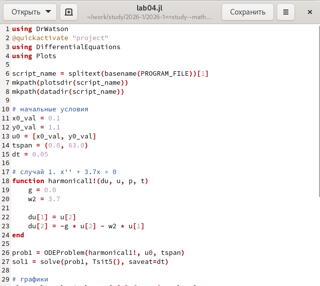
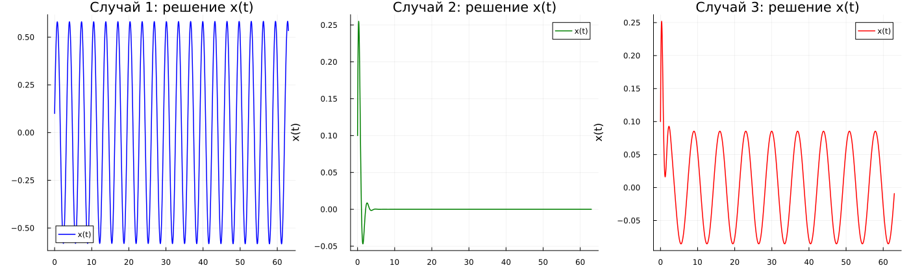

---
# Preamble

## Author
author:
  name: Иванов Сергей Владимирович
## Title
title: Отчёт по лабораторной работе №4
subtitle: Математическое моделирование
license: CC BY
date: 2026-04-01

## Generic options
lang: ru-RU
crossref:
  lof-title: Список иллюстраций
  lot-title: Список таблиц
  lol-title: Листинги

## Fonts 
mainfont: PT Serif 
romanfont: PT Serif 
sansfont: PT Sans 
monofont: PT Mono 
mainfontoptions: Ligatures=TeX 
romanfontoptions: Ligatures=TeX 
sansfontoptions: Ligatures=TeX,Scale=MatchLowercase 
monofontoptions: Scale=MatchLowercase,Scale=0.9

## Formats
format:
### Pdf output format
  beamer:
    toc: true
    toc-title: Содержание
    number-sections: true
    colorlinks: false
    toc-depth: 2
    slide_level: 2
    aspectratio: 169
    section-titles: true
    theme: metropolis
    themeoptions: progressbar=frametitle,sectionpage=progressbar,numbering=fraction
    pdf-engine: xelatex
    fontenc: T2A
#### Language
    babel-lang: russian
    babel-otherlangs: english

### Html output
  revealjs:
    transition: slide
    margin: 0.2
    smaller: false
    output-ext: html
    theme: beige
    logo: _resources/image/logo_rudn.png
---

# Вводная часть

## Цель работы

Целью лабораторной работы является построение решения уравнения гармонического осциллятора и его фазового портрета для трех случаев - без затухания и 
внешней силы, с затуханием, с затуханием и периодическим внешним воздействием. 

# Выполнение лабораторной работы

## Рассчет варианта

Номер студенческого билета: 1132236127. Рассчитаем вариант: 1132236127 mod 70 + 1 = 58. Значит, делаю вариант 58.

## Математическая модель 

{#fig-000 width=70%}

## Математическая модель 

{#fig-000 width=70%}

## Математическая модель 

{#fig-000 width=70%}

## Программный код

{#fig-001 width=70%}

## Просмотр графиков

{#fig-002 width=70%}

# Подведение итогов

## Выводы

В результате выполнения лабораторной работы была построена модель гармонических колебаний. Выполнено численное решение уравнения 
гармонического осциллятора для трех случаев: свободные колебания без затухания, затухающие колебания без внешней силы, вынужденные 
колебания с затуханием под действием периодической силы. 
