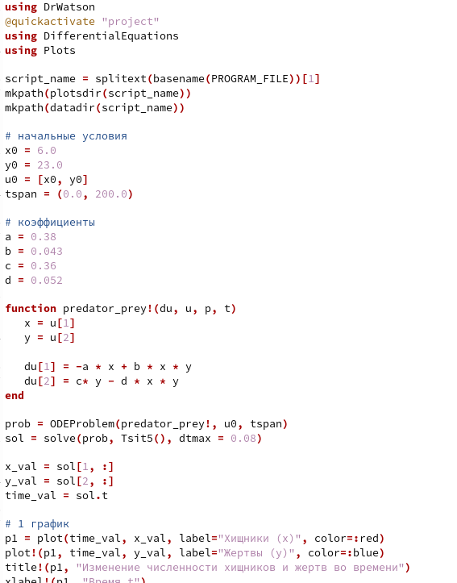
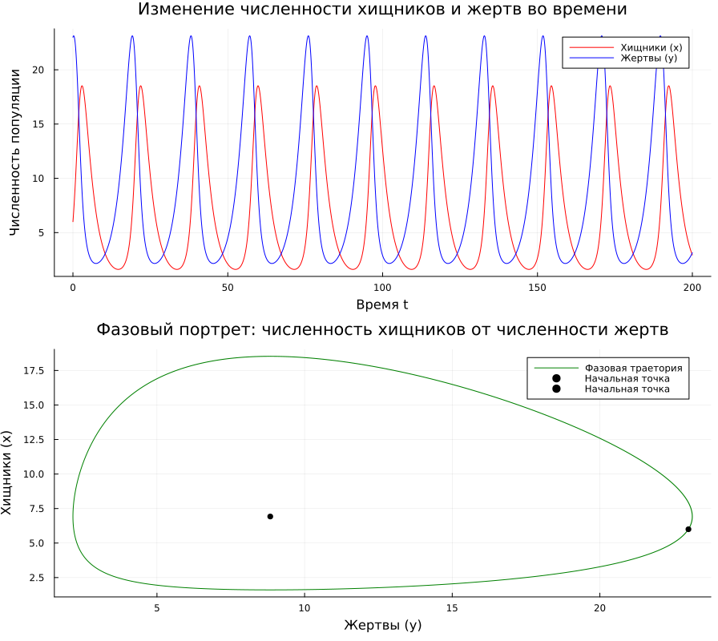

---
## Author
author: Иванов Сергей Владимирович, НПИбд-01-23

## Title
title: "Отчёт по лабораторной работе №5"
subtitle: "Дисциплина: Математическое моделирование"
license: "CC BY"
---

# Цель работы

Целью лабораторной работы является построение простейшей модель взаимодействия двух видов типа «хищник — жертва» -
модель Лотки-Вольтерры. 

# Выполнение лабораторной работы

Номер студенческого билета: 1132236127. Рассчитаем вариант: 1132236127 mod 70 + 1 = 58. Значит, делаю вариант 58.

## Математическая модель

В данной лабораторной работе рассматривается простейшая математическая модель взаимодействия двух видов типа «хищник — жертва» — модель Лотки-Вольтерры.

Пусть $x(t)$ — численность популяции хищников (волков), а $y(t)$ — численность популяции жертв (зайцев) в момент времени $t$. 

Динамика изменения численности популяций описывается следующей системой обыкновенных дифференциальных уравнений:

$$
\begin{cases}
\frac{dx}{dt} = -0.38\, x(t) + 0.043\, x(t)y(t) \\
\frac{dy}{dt} = 0.36\, y(t) - 0.052\, x(t)y(t)
\end{cases}
$$

где  
- $a = 0.38$ — коэффициент смертности хищников,  
- $b = 0.043$ — коэффициент прироста хищников за счёт поедания жертв,  
- $c = 0.36$ — коэффициент естественного прироста жертв,  
- $d = 0.052$ — коэффициент смертности жертв от хищников.

### Физический (биологический) смысл уравнения

Каждое слагаемое в правой части уравнений имеет строгий биологический смысл:

- $\frac{dx}{dt}$ и $\frac{dy}{dt}$ — скорости изменения численности волков и зайцев соответственно.  
- Слагаемое $-0.38\,x(t)$ описывает естественную убыль популяции хищников (смертность от старости и болезней) в отсутствие пищи. Знак минус указывает на уменьшение популяции.  
- Слагаемое $0.36\,y(t)$ описывает естественный прирост популяции жертв в условиях неограниченного ресурса (травы) и в отсутствие хищников.  
- Произведение $x(t)y(t)$ пропорционально частоте встреч хищников и жертв.  
- Слагаемое $-0.052\,x(t)y(t)$ показывает убыль популяции зайцев за счёт того, что их съедают волки.  
- Слагаемое $+0.043\,x(t)y(t)$ показывает прирост популяции волков за счёт поглощённой пищи.

### Стационарное состояние системы

По заданию необходимо найти стационарное состояние системы — такое состояние, при котором численность обеих популяций остаётся неизменной во времени. Это означает, что скорости изменения популяций равны нулю: $\frac{dx}{dt} = 0$ и $\frac{dy}{dt} = 0$.

Приравняем правые части уравнений к нулю:

$$
\begin{cases}
-0.38\, x + 0.043\, x y = 0 \\
0.36\, y - 0.052\, x y = 0
\end{cases}
$$

Вынесем общие множители за скобки:

$$
\begin{cases}
x(-0.38 + 0.043\, y) = 0 \\
y(0.36 - 0.052\, x) = 0
\end{cases}
$$

Так как нулевая численность ($x=0$, $y=0$) нас не интересует (это тривиальное состояние вымирания обоих видов), мы приравниваем к нулю выражения в скобках:

$$
-0.38 + 0.043\, y = 0 \implies y = \frac{0.38}{0.043} \approx 8.8372
$$

$$
0.36 - 0.052\, x = 0 \implies x = \frac{0.36}{0.052} \approx 6.9231
$$

Таким образом, координаты стационарной точки:  
$$ x_0 \approx 6.9231, \quad y_0 \approx 8.8372. $$

Если в начальный момент времени задать численность хищников и жертв равной этим значениям, система будет находиться в равновесии бесконечно долго. Любое отклонение от этой точки приведёт к возникновению периодических колебаний численности.

## Программный код 

Напишем код для реализации модели. (рис. 1)

```julia
using DrWatson
@quickactivate "project" 
using DifferentialEquations
using Plots

script_name = splitext(basename(PROGRAM_FILE))[1]
mkpath(plotsdir(script_name))
mkpath(datadir(script_name))

# начальные условия
x0 = 6.0 
y0 = 23.0
u0 = [x0, y0]
tspan = (0.0, 200.0)

# коэффициенты
a = 0.38
b = 0.043
c = 0.36
d = 0.052

function predator_prey!(du, u, p, t)
   x = u[1] 
   y = u[2]
   
   du[1] = -a * x + b * x * y
   du[2] = c* y - d * x * y
end

prob = ODEProblem(predator_prey!, u0, tspan)
sol = solve(prob, Tsit5(), dtmax = 0.08)

x_val = sol[1, :]
y_val = sol[2, :]
time_val = sol.t

# 1 график
p1 = plot(time_val, x_val, label="Хищники (х)", color=:red)
plot!(p1, time_val, y_val, label="Жертвы (у)", color=:blue)
title!(p1, "Изменение численности хищников и жертв во времени")
xlabel!(p1, "Время t")
ylabel!(p1, "Численность популяции")

# 2 график
p2 = plot(y_val, x_val, label="Фазовая траетория", color=:green)
scatter!(p2, [y0], [x0], label="Начальная точка", color=:black)

# стационарное состояние
x_eq = c / d
y_eq = a / b
scatter!(p2, [y_eq], [x_eq], label = "Начальная точка", color = :black)

title!(p2, "Фазовый портрет: численность хищников от численности жертв")
xlabel!(p2, "Жертвы (у)")
ylabel!(p2, "Хищники (х)")

solutions = plot(p1, p2, layout=(2,1), size=(900, 800))

savefig(plotsdir(script_name, "lab05.png"))
println("Графики сохранены: lab05_var58.png")
```

{#fig-001 width=70%}

Также  как выглядят просмотримполученные графики. (рис. 2)

{#fig-002 width=70%}

# Вывод 

В результате выполнения лабораторной работы была построена простейшей модель взаимодействия двух видов типа «хищник — жертва» -
модель Лотки-Вольтерры. Была составлена программа и построены графики. 
