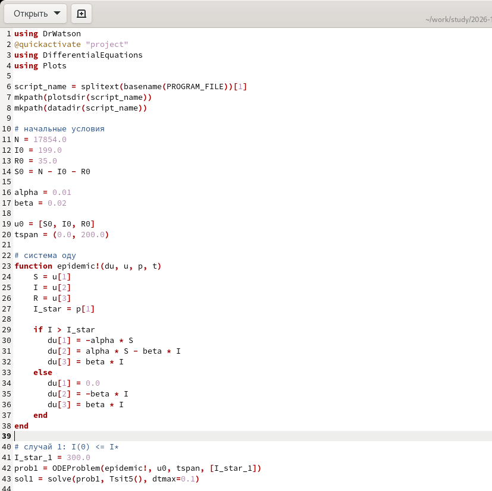
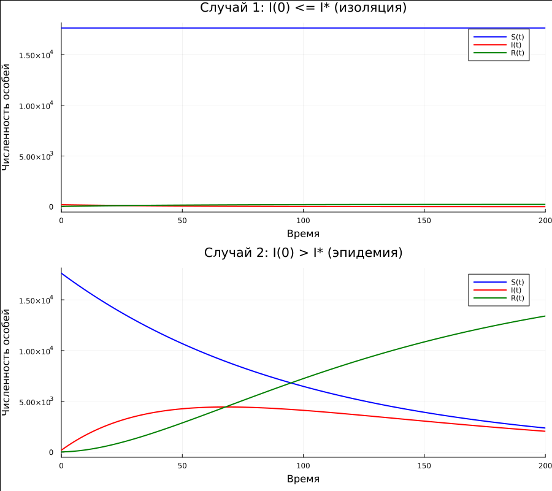

---
## Author
author: Иванов Сергей Владимирович, НПИбд-01-23

## Title
title: "Отчёт по лабораторной работе №6"
subtitle: "Дисциплина: Математическое моделирование"
license: "CC BY"
---

# Цель работы

Целью лабораторной работы является построение графиков изменения числа особей в каждой из трех групп.
Рассмотреть, как будет протекать эпидемия в двух случаях.

# Выполнение лабораторной работы 

Номер студенческого билета: 1132236127. Рассчитаем вариант: 1132236127 mod 70 + 1 = 58. Значит, делаю вариант 58.

## Математическая модель

В данной лабораторной работе рассматривается математическая модель распространения эпидемии — классическая SIR-модель.

Все население острова разбивается на три группы:
- $S(t)$ — число восприимчивых (здоровых, но не имеющих иммунитета) людей,
- $I(t)$ — число инфицированных (распространителей инфекции),
- $R(t)$ — число людей с иммунитетом (переболевших или невосприимчивых).

Общее население постоянно:
$$
N = S(t) + I(t) + R(t)
$$

По условию:
$$
N = 17854, \quad I(0) = 199, \quad R(0) = 35
$$

Начальное число восприимчивых:
$$
S(0) = N - I(0) - R(0) = 17854 - 199 - 35 = 17620
$$

Динамика распространения эпидемии описывается системой дифференциальных уравнений:

$$
\begin{cases}
\frac{dS}{dt} = -\beta S(t) I(t) \\
\frac{dI}{dt} = \beta S(t) I(t) - \gamma I(t) \\
\frac{dR}{dt} = \gamma I(t)
\end{cases}
$$

где  
- $\beta$ — коэффициент заражения,  
- $\gamma$ — коэффициент выздоровления.

### Физический смысл уравнений

Каждое уравнение описывает изменение численности соответствующей группы:

- $\frac{dS}{dt}$ — скорость изменения числа восприимчивых людей.  
  Слагаемое $-\beta S I$ показывает уменьшение числа здоровых за счёт заражения. Чем больше контактов между $S$ и $I$, тем быстрее распространяется болезнь.

- $\frac{dI}{dt}$ — скорость изменения числа инфицированных.  
  Слагаемое $+\beta S I$ — приток новых заболевших.  
  Слагаемое $-\gamma I$ — уменьшение числа инфицированных за счёт выздоровления.

- $\frac{dR}{dt}$ — скорость изменения числа людей с иммунитетом.  
  Слагаемое $+\gamma I$ показывает, что переболевшие переходят в группу $R$.

### Порог эпидемии

Важной характеристикой модели является пороговое значение числа инфицированных $I^*$.

Если:
$$
I(0) \leq I^*
$$
— эпидемия затухает.

Если:
$$
I(0) > I^*
$$
— эпидемия развивается.

Порог определяется через параметры модели и связан с базовым репродуктивным числом:
$$
R_0 = \frac{\beta S(0)}{\gamma}
$$

Если $R_0 > 1$ — эпидемия распространяется.  
Если $R_0 < 1$ — эпидемия затухает.

### Начальные условия

Для моделирования используются следующие начальные значения:
$$
S(0) = 17620, \quad I(0) = 199, \quad R(0) = 35
$$

Эти значения задают начальное состояние системы и используются для построения графиков изменения численности групп во времени.

## Программный код 

Напишем код для реализации модели. (рис. 1)

```julia
using DrWatson
@quickactivate "project" 
using DifferentialEquations
using Plots

script_name = splitext(basename(PROGRAM_FILE))[1]
mkpath(plotsdir(script_name))
mkpath(datadir(script_name))

# начальные условия
N = 17854.0
I0 = 199.0
R0 = 35.0
S0 = N - I0 - R0

alpha = 0.01
beta = 0.02

u0 = [S0, I0, R0]
tspan = (0.0, 200.0)

# система оду
function epidemic!(du, u, p, t)
    S = u[1]
    I = u[2]
    R = u[3]
    I_star = p[1]

    if I > I_star
       du[1] = -alpha * S
       du[2] = alpha * S - beta * I 
       du[3] = beta * I 
    else
       du[1] = 0.0 
       du[2] = -beta * I
       du[3] = beta * I
    end
end

# случай 1: I(0) <= I*
I_star_1 = 300.0
prob1 = ODEProblem(epidemic!, u0, tspan, [I_star_1])
sol1 = solve(prob1, Tsit5(), dtmax=0.1)

# случай 2: I(0) > I*
I_star_2 = 100.0
prob2 = ODEProblem(epidemic!, u0, tspan, [I_star_2])
sol2 = solve(prob2, Tsit5(), dtmax=0.1)

p1 = plot(sol1, label = ["S(t)" "I(t)" "R(t)"], lw=2, color = [:blue :red :green], 
    title = "Случай 1: I(0) <= I* (изоляция)", xlabel = "Время", ylabel = "Численность особей")
    
p2 = plot(sol2, label = ["S(t)" "I(t)" "R(t)"], lw=2, color = [:blue :red :green], 
    title = "Случай 2: I(0) > I* (эпидемия)", xlabel = "Время", ylabel = "Численность особей")
    
fig = plot(p1, p2, layout=(2,1), size=(900, 800))
savefig(plotsdir(script_name, "lab06.png"))
println("Графики сохранены: lab06_var58.png")
```

{#fig-001 width=70%}

Также  как выглядят просмотримполученные графики. (рис. 2)

{#fig-002 width=70%}

# Вывод 

В результате выполнения лабораторной работы были построены графики изменения числа особей в каждой из трех групп.
Рассмотрено, как будет протекать эпидемия в двух случаях.
