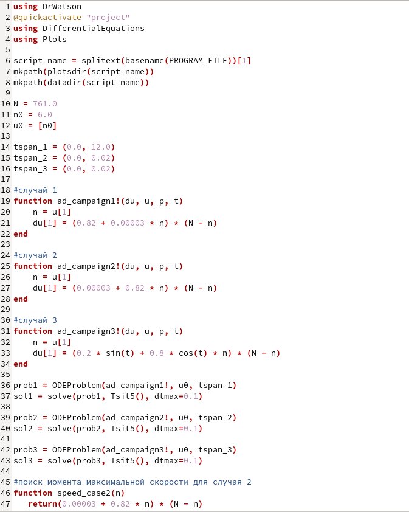
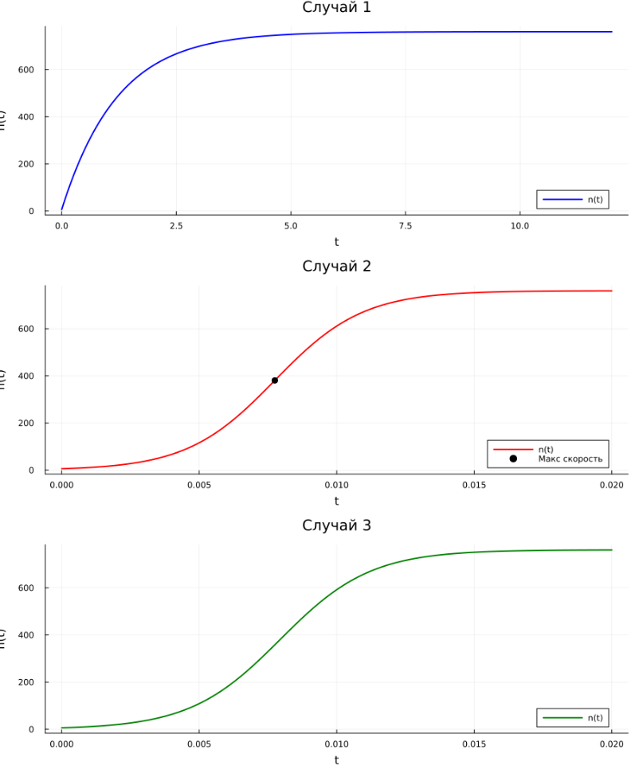

---
## Author
author: Иванов Сергей Владимирович, НПИбд-01-23

## Title
title: "Отчёт по лабораторной работе №7"
subtitle: "Дисциплина: Математическое моделирование"
license: "CC BY"
---

# Цель работы

Целью лабораторной работы является построение графика распространения рекламы.

# Выполнение лабораторной работы 

Номер студенческого билета: 1132236127. Рассчитаем вариант: 1132236127 mod 70 + 1 = 58. Значит, делаю вариант 58.

## Математическая модель

В лабораторной работе рассматривается процесс распространения информации о товаре среди потенциальных покупателей.  
Пусть:

- $N$ — общее количество потенциальных покупателей;
- $n(t)$ — количество людей, которые знают о товаре в момент времени $t$;
- $N - n(t)$ — количество людей, которые еще не знают о товаре;
- $\frac{dn}{dt}$ — скорость распространения информации о товаре.

Смысл модели заключается в том, что реклама распространяется двумя способами:

1. за счет прямого воздействия рекламной кампании;
2. за счет передачи информации между людьми, то есть за счет «сарафанного радио».

Общая математическая модель имеет вид:

$$
\frac{dn}{dt} =
\left(\alpha_1(t) + \alpha_2(t)n(t)\right)(N - n(t)),
$$

где $\alpha_1(t)$ характеризует интенсивность платной рекламы, а $\alpha_2(t)$ характеризует эффективность распространения информации между людьми.

В моем варианте задано:

$$
N = 761,
$$

$$
n(0) = 6.
$$

То есть в начальный момент времени о товаре знают 6 человек из 761 потенциального покупателя.

Согласно варианту №58 необходимо рассмотреть три случая.

### Первый случай

В первом случае модель имеет вид:

$$
\frac{dn}{dt} =
\left(0.82 + 0.00003n(t)\right)(761 - n(t)).
$$

Здесь коэффициент при платной рекламе значительно больше коэффициента при «сарафанном радио»:

$$
\alpha_1 = 0.82,
$$

$$
\alpha_2 = 0.00003.
$$

Следовательно, основное влияние на распространение информации оказывает именно платная реклама.  
Такой процесс должен достаточно быстро увеличивать количество информированных покупателей в начале рекламной кампании, а затем рост будет замедляться по мере приближения $n(t)$ к предельному значению $N = 761$.

### Второй случай

Во втором случае модель имеет вид:

$$
\frac{dn}{dt} =
\left(0.00003 + 0.82n(t)\right)(761 - n(t)).
$$

Здесь коэффициенты принимают значения:

$$
\alpha_1 = 0.00003,
$$

$$
\alpha_2 = 0.82.
$$

В этом случае платная реклама оказывает очень слабое влияние, а основной вклад дает распространение информации между людьми.  
Поэтому график должен иметь характер, близкий к логистическому росту: сначала информация распространяется медленнее, затем скорость резко возрастает, а после насыщения аудитории снова уменьшается.

Для второго случая необходимо определить момент времени, когда скорость распространения рекламы достигает максимума.

Обозначим скорость распространения рекламы через $v(n)$:

$$
v(n) =
\left(0.00003 + 0.82n\right)(761 - n).
$$

Раскроем общий вид для случая

$$
v(n) = (a + bn)(N - n),
$$

где:

$$
a = 0.00003,
$$

$$
b = 0.82,
$$

$$
N = 761.
$$

Максимум скорости найдем из условия:

$$
\frac{dv}{dn} = 0.
$$

Выполним дифференцирование:

$$
v(n) = (a + bn)(N - n),
$$

$$
\frac{dv}{dn} = bN - a - 2bn.
$$

Тогда:

$$
bN - a - 2bn = 0.
$$

Отсюда значение $n$, при котором скорость максимальна:

$$
n^* = \frac{bN - a}{2b}.
$$

Подставим значения из варианта:

$$
n^* =
\frac{0.82 \cdot 761 - 0.00003}{2 \cdot 0.82}
\approx 380.5.
$$

Следовательно, максимальная скорость распространения рекламы достигается примерно тогда, когда о товаре знает половина аудитории:

$$
n^* \approx \frac{N}{2}.
$$

Для нахождения соответствующего момента времени используется численное решение дифференциального уравнения.  
По результатам моделирования для второго случая получаем:

$$
t^* \approx 0.00775.
$$

То есть максимальная скорость распространения рекламы достигается примерно в момент времени:

$$
t \approx 0.00775.
$$

### Третий случай

В третьем случае коэффициенты зависят от времени. Модель имеет вид:

$$
\frac{dn}{dt} =
\left(0.2\sin(t) + 0.8\cos(t)n(t)\right)(761 - n(t)).
$$

Здесь:

$$
\alpha_1(t) = 0.2\sin(t),
$$

$$
\alpha_2(t) = 0.8\cos(t).
$$

Этот случай отличается от первых двух тем, что интенсивность рекламы и эффективность «сарафанного радио» меняются со временем.  
Такая модель может описывать ситуацию, когда активность рекламной кампании зависит от сезона, времени проведения акции или изменения интереса покупателей к товару.

### Начальное условие

Для всех трех случаев используется одно и то же начальное условие:

$$
n(0) = 6.
$$

Это означает, что в момент начала рекламной кампании о товаре знают только 6 человек.  
Далее с помощью численного решения дифференциальных уравнений строятся графики функции $n(t)$ для каждого из трех случаев.

## Программный код 

Напишем код для реализации модели. (рис. 1)

```julia
using DrWatson
@quickactivate "project" 
using DifferentialEquations
using Plots

script_name = splitext(basename(PROGRAM_FILE))[1]
mkpath(plotsdir(script_name))
mkpath(datadir(script_name))

N = 761.0
n0 = 6.0
u0 = [n0]

tspan_1 = (0.0, 12.0)
tspan_2 = (0.0, 0.02)
tspan_3 = (0.0, 0.02)

#случай 1
function ad_campaign1!(du, u, p, t)
    n = u[1]
    du[1] = (0.82 + 0.00003 * n) * (N - n)
end

#случай 2
function ad_campaign2!(du, u, p, t)
    n = u[1]
    du[1] = (0.00003 + 0.82 * n) * (N - n)
end

#случай 3
function ad_campaign3!(du, u, p, t)
    n = u[1]
    du[1] = (0.2 * sin(t) + 0.8 * cos(t) * n) * (N - n)
end

prob1 = ODEProblem(ad_campaign1!, u0, tspan_1)
sol1 = solve(prob1, Tsit5(), dtmax=0.1)

prob2 = ODEProblem(ad_campaign2!, u0, tspan_2)
sol2 = solve(prob2, Tsit5(), dtmax=0.1)

prob3 = ODEProblem(ad_campaign3!, u0, tspan_3)
sol3 = solve(prob3, Tsit5(), dtmax=0.1)

#поиск момента максимальной скорости для случая 2
function speed_case2(n)
   return(0.00003 + 0.82 * n) * (N - n)
end

t_dense2 = range(tspan_2[1], tspan_2[2], length=10000)
speeds2 = [speed_case2(sol2(t)[1]) for t in t_dense2]

max_speed_value, max_speed_index = findmax(speeds2)
max_speed_time = t_dense2[max_speed_index]
max_speed_n = sol2(max_speed_time)[1]

println("Случай 2")
println("Максимальная скорость распространения рекламы: ")
println("t = ", round(max_speed_time, digits=6))
println("n(t) = ", round(max_speed_n, digits=3), " человек за единицу времени")

#построение графика
t1 = range(tspan_1[1], tspan_1[2], length=1000)
n1 = [sol1(t)[1] for t in t1]

t2 = range(tspan_2[1], tspan_2[2], length=1000)
n2 = [sol2(t)[1] for t in t2]

t3 = range(tspan_3[1], tspan_3[2], length=1000)
n3 = [sol3(t)[1] for t in t3]

p1 = plot(t1, n1, title="Случай 1", label="n(t)", xlabel="t", ylabel="n(t)", 
    lw=2, color=:blue, legend=:bottomright)
    
p2 = plot(t2, n2, title="Случай 2", label="n(t)", xlabel="t", ylabel="n(t)", 
    lw=2, color=:red, legend=:bottomright)
    
scatter!(p2, [max_speed_time], [max_speed_n], label="Макс скорость", 
    color=:black, markersize=5)
   
p3 = plot(t3, n3, title="Случай 3", label="n(t)", xlabel="t", ylabel="n(t)", 
    lw=2, color=:green, legend=:bottomright)
    
fig = plot(p1, p2, p3, layout=(3,1), size=(900, 1100))
savefig(plotsdir(script_name, "lab07.png"))
println("Графики сохранены: lab07_var58.png")
```

{#fig-001 width=70%}

Также  как выглядят просмотримполученные графики. (рис. 2)

{#fig-002 width=70%}

# Вывод 

В результате выполнения лабораторной работы были построены графики распространения рекламы.
