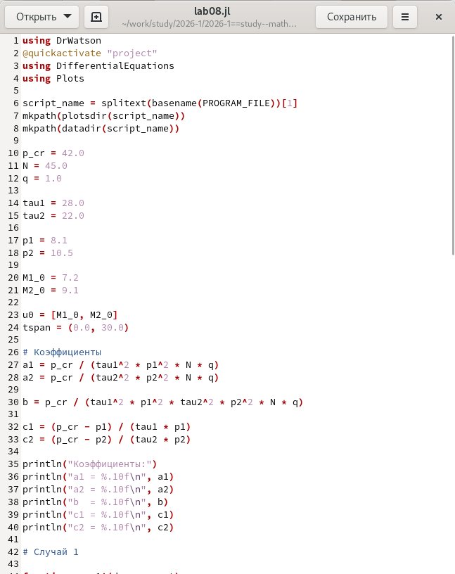
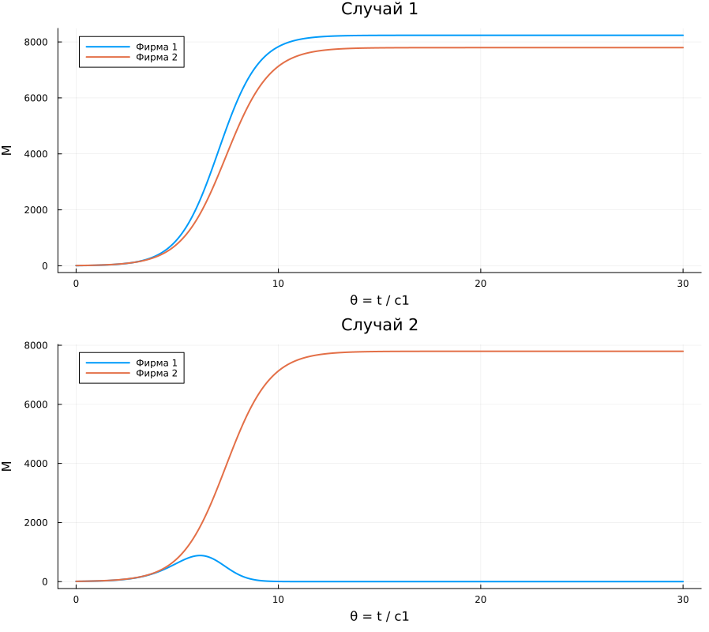

---
## Author
author: Иванов Сергей Владимирович, НПИбд-01-23

## Title
title: "Отчёт по лабораторной работе №8"
subtitle: "Дисциплина: Математическое моделирование"
license: "CC BY"
---

# Цель работы

Целью лабораторной работы является построение модели конкуренции двух фирм для двух случаев.

# Выполнение лабораторной работы 

Номер студенческого билета: 1132236127. Рассчитаем вариант: 1132236127 mod 70 + 1 = 58. Значит, делаю вариант 58.

## Математическая модель

В данной лабораторной работе рассматривается модель конкуренции двух фирм, производящих взаимозаменяемые товары одинакового качества и находящихся в одной рыночной нише. Предполагается, что у потребителей нет заранее заданных предпочтений, поэтому конкуренция ведется только рыночными методами.

Основными переменными модели являются оборотные средства первой и второй фирмы:

$$
M_1, \quad M_2.
$$

Для варианта 58 заданы начальные условия:

$$
M_1(0)=7{,}2, \quad M_2(0)=9{,}1.
$$

Параметры модели:

$$
p_{cr}=42, \quad N=45, \quad q=1,
$$

$$
\tau_1=28, \quad \tau_2=22,
$$

$$
\tilde{p}_1=8{,}1, \quad \tilde{p}_2=10{,}5.
$$

Здесь $p_{cr}$ — критическая стоимость продукта, $N$ — число потребителей, $q$ — максимальная потребность одного человека в продукте, $\tau$ — длительность производственного цикла, $\tilde{p}$ — себестоимость товара.

Коэффициенты модели вычисляются по формулам:

$$
a_1 = \frac{p_{cr}}{\tau_1^2 \tilde{p}_1^2 N q},
\quad
a_2 = \frac{p_{cr}}{\tau_2^2 \tilde{p}_2^2 N q},
$$

$$
b = \frac{p_{cr}}{\tau_1^2 \tilde{p}_1^2 \tau_2^2 \tilde{p}_2^2 N q},
$$

$$
c_1 = \frac{p_{cr} - \tilde{p}_1}{\tau_1 \tilde{p}_1},
\quad
c_2 = \frac{p_{cr} - \tilde{p}_2}{\tau_2 \tilde{p}_2}.
$$

После подстановки параметров варианта 58 получаем:

$$
a_1 = \frac{42}{28^2 \cdot 8{,}1^2 \cdot 45 \cdot 1}
\approx 1{,}81447 \cdot 10^{-5},
$$

$$
a_2 = \frac{42}{22^2 \cdot 10{,}5^2 \cdot 45 \cdot 1}
\approx 1{,}74909 \cdot 10^{-5},
$$

$$
b = \frac{42}{28^2 \cdot 8{,}1^2 \cdot 22^2 \cdot 10{,}5^2 \cdot 45 \cdot 1}
\approx 3{,}40037 \cdot 10^{-10},
$$

$$
c_1 = \frac{42 - 8{,}1}{28 \cdot 8{,}1}
\approx 0{,}14947,
$$

$$
c_2 = \frac{42 - 10{,}5}{22 \cdot 10{,}5}
\approx 0{,}13636.
$$

Для упрощения решения вводится безразмерное время:

$$
\theta = \frac{t}{c_1}.
$$

### Случай 1: конкуренция только рыночными методами

В первом случае рассматривается ситуация, когда фирмы конкурируют только за счет экономических факторов. Они могут изменять себестоимость продукции и длительность производственного цикла, но не могут напрямую воздействовать на потребителей.

Система дифференциальных уравнений имеет вид:

$$
\left\{
\begin{array}{l}
\frac{dM_1}{d\theta} = M_1 - \frac{b}{c_1}M_1M_2 - \frac{a_1}{c_1}M_1^2, \\
\frac{dM_2}{d\theta} = \frac{c_2}{c_1}M_2 - \frac{b}{c_1}M_1M_2 - \frac{a_2}{c_1}M_2^2.
\end{array}
\right.
$$

Для варианта 58 после подстановки коэффициентов система принимает вид:

$$
\left\{
\begin{array}{l}
\frac{dM_1}{d\theta} = M_1 - 2{,}27494 \cdot 10^{-9} M_1M_2 - 1{,}21393 \cdot 10^{-4} M_1^2, \\
\frac{dM_2}{d\theta} = 0{,}91231M_2 - 2{,}27494 \cdot 10^{-9} M_1M_2 - 1{,}17019 \cdot 10^{-4} M_2^2.
\end{array}
\right.
$$

В данном случае коэффициент перед произведением $M_1M_2$ одинаков в обоих уравнениях. Это означает, что фирмы конкурируют между собой только за счет рыночных факторов.

### Стационарное состояние для случая 1

Стационарное состояние системы — это состояние, при котором оборотные средства фирм перестают изменяться со временем:

$$
\frac{dM_1}{d\theta}=0,
\quad
\frac{dM_2}{d\theta}=0.
$$

Исключая тривиальное решение, получаем систему:

$$
\left\{
\begin{array}{l}
a_1M_1 + bM_2 = c_1, \\
bM_1 + a_2M_2 = c_2.
\end{array}
\right.
$$

Решение этой системы:

$$
M_1^* = \frac{c_1a_2 - bc_2}{a_1a_2 - b^2},
$$

$$
M_2^* = \frac{a_1c_2 - bc_1}{a_1a_2 - b^2}.
$$

Для варианта 58 стационарное состояние равно:

$$
M_1^* \approx 8237{,}5539,
$$

$$
M_2^* \approx 7796{,}0899.
$$

Следовательно, в первом случае обе фирмы остаются на рынке. Первая фирма со временем выходит на уровень оборотных средств примерно $8237{,}55$, а вторая фирма — примерно $7796{,}09$.

### Случай 2: влияние социально-психологических факторов

Во втором случае, кроме экономических факторов, учитывается социально-психологический фактор. Он отражает формирование предпочтения одного товара другому независимо от качества и цены.

Для варианта 58 дополнительный коэффициент равен:

$$
\Delta = 0{,}00048.
$$

В этом случае коэффициент перед произведением $M_1M_2$ в первом уравнении увеличивается:

$$
\left\{
\begin{array}{l}
\frac{dM_1}{d\theta} = M_1 - \left(\frac{b}{c_1}+\Delta\right)M_1M_2 - \frac{a_1}{c_1}M_1^2, \\
\frac{dM_2}{d\theta} = \frac{c_2}{c_1}M_2 - \frac{b}{c_1}M_1M_2 - \frac{a_2}{c_1}M_2^2.
\end{array}
\right.
$$

После подстановки коэффициентов получаем:

$$
\left\{
\begin{array}{l}
\frac{dM_1}{d\theta} = M_1 - 0{,}000480002 M_1M_2 - 1{,}21393 \cdot 10^{-4} M_1^2, \\
\frac{dM_2}{d\theta} = 0{,}91231M_2 - 2{,}27494 \cdot 10^{-9} M_1M_2 - 1{,}17019 \cdot 10^{-4} M_2^2.
\end{array}
\right.
$$

Из-за увеличения коэффициента перед $M_1M_2$ первая фирма оказывается в менее выгодном положении. Несмотря на возможный начальный рост, затем ее оборотные средства начинают уменьшаться. Вторая фирма, наоборот, получает преимущество и закрепляется на рынке.

Таким образом, во втором случае социально-психологический фактор существенно меняет результат конкуренции: первая фирма постепенно вытесняется с рынка, а вторая фирма занимает большую часть рынка.

## Программный код 

Напишем код для реализации модели. (рис. 1)

```julia
using DrWatson
@quickactivate "project" 
using DifferentialEquations
using Plots

script_name = splitext(basename(PROGRAM_FILE))[1]
mkpath(plotsdir(script_name))
mkpath(datadir(script_name))

p_cr = 42.0
N = 45.0
q = 1.0

tau1 = 28.0
tau2 = 22.0

p1 = 8.1
p2 = 10.5

M1_0 = 7.2
M2_0 = 9.1

u0 = [M1_0, M2_0]
tspan = (0.0, 30.0)

# Коэффициенты
a1 = p_cr / (tau1^2 * p1^2 * N * q)
a2 = p_cr / (tau2^2 * p2^2 * N * q)

b = p_cr / (tau1^2 * p1^2 * tau2^2 * p2^2 * N * q)

c1 = (p_cr - p1) / (tau1 * p1)
c2 = (p_cr - p2) / (tau2 * p2)

println("Коэффициенты:")
println("a1 = %.10f\n", a1)
println("a2 = %.10f\n", a2)
println("b  = %.10f\n", b)
println("c1 = %.10f\n", c1)
println("c2 = %.10f\n", c2)

# Случай 1

function case1!(du, u, p, t)
    M1 = u[1]
    M2 = u[2]

    du[1] = M1 - (b / c1) * M1 * M2 - (a1 / c1) * M1^2
    du[2] = (c2 / c1) * M2 - (b / c1) * M1 * M2 - (a2 / c1) * M2^2
end

# Случай 2

function case2!(du, u, p, t)
    M1 = u[1]
    M2 = u[2]

    du[1] = M1 - (b / c1 + 0.00048) * M1 * M2 - (a1 / c1) * M1^2
    du[2] = (c2 / c1) * M2 - (b / c1) * M1 * M2 - (a2 / c1) * M2^2
end

# Решение систем

prob1 = ODEProblem(case1!, u0, tspan)
sol1 = solve(prob1, Tsit5(), dtmax=0.1)

prob2 = ODEProblem(case2!, u0, tspan)
sol2 = solve(prob2, Tsit5(), dtmax=0.1)

theta = 0:0.01:30

y1 = reduce(hcat, sol1.(theta))
y2 = reduce(hcat, sol2.(theta))

# Стационарное состояние случая 1

D = a1 * a2 - b^2

M1_st = (c1 * a2 - b * c2) / D
M2_st = (a1 * c2 - b * c1) / D

println()
println("Стационарное состояние случая 1:")
println("M1* = %.4f\n", M1_st)
println("M2* = %.4f\n", M2_st)

# График случая 1

plot1 = plot(
    theta, y1[1, :],
    label="Фирма 1",
    linewidth=2,
    xlabel="θ = t / c1",
    ylabel="M",
    title="Случай 1"
)

plot!(
    theta, y1[2, :],
    label="Фирма 2",
    linewidth=2
)

# График случая 2

plot2 = plot(
    theta, y2[1, :],
    label="Фирма 1",
    linewidth=2,
    xlabel="θ = t / c1",
    ylabel="M",
    title="Случай 2"
)

plot!(
    theta, y2[2, :],
    label="Фирма 2",
    linewidth=2
)

# Вывод двух графиков

plot(plot1, plot2, layout=(2, 1), size=(900, 800))
savefig(plotsdir(script_name, "lab08.png"))
println("Графики сохранены: lab08_var58.png")
```

{#fig-001 width=70%}

Также  как выглядят просмотримполученные графики. (рис. 2)

{#fig-002 width=70%}

# Вывод 

В результате выполнения лабораторной работы были построены модели конкуренции двух фирм для двух случаев.
