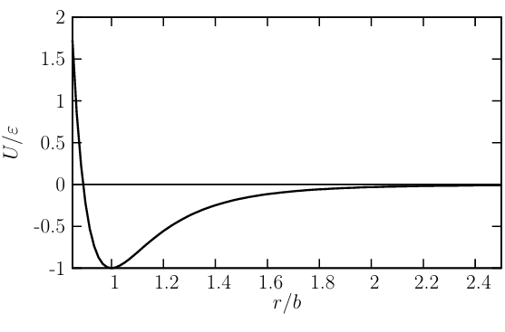

---
## Author
author: 

- Иванов С.В., 
- Газизянов В.А., 
- Жаворонков К.А., 
- Кобзев Д.К., 
- Базлов В.А.

## Title
title: "Отчёт по групповому проекту. Этап 1"
subtitle: "Молекулярная динамика"
license: "CC BY"
date: 2026-03-20
---

# Цель работы

Целью первого этапа проекта является изучение теоретических основ метода молекулярной динамики: построение математической модели системы взаимодействующих частиц, описание уравнений движения и потенциала взаимодействия.

# Состав исследовательской группы

- Иванов С.В.
- Газизянов В.А.
- Жаворонков К.А.
- Кобзев Д.К.
- Базлов В.А.

# Актуальность исследования

Молекулярная динамика — метод компьютерного моделирования движения атомов и молекул, позволяющий исследовать процессы на атомном уровне.

Метод применяется в следующих областях:

- **физика** — исследование структуры вещества и фазовых переходов;
- **химия** — изучение взаимодействия молекул;
- **материаловедение** — анализ свойств материалов на атомном уровне;
- **биофизика** — моделирование поведения биологических молекул.

# Объект и предмет исследования

**Объект исследования** — система взаимодействующих частиц.

**Предмет исследования:**

- динамика движения частиц;
- изменение координат и скоростей частиц во времени.

# Цель и задачи проекта

**Цель проекта:** исследовать движение системы частиц методом молекулярной динамики.

**Задачи проекта:**

1. Изучить теоретические основы молекулярной динамики.
2. Рассмотреть математическую модель движения частиц.
3. Определить силы взаимодействия между частицами.
4. Построить модель движения системы.

# Теоретические сведения

## Метод молекулярной динамики

Метод молекулярной динамики основан на решении уравнений движения Ньютона для системы частиц. Для каждой частицы $i$ справедливо уравнение:

$$m_i \frac{d^2 \vec{r}_i}{dt^2} = \vec{F}_i$$

где:

- $m_i$ — масса частицы;
- $\vec{r}_i$ — радиус-вектор (координаты) частицы;
- $\vec{F}_i$ — суммарная сила, действующая на частицу.

Зная силы взаимодействия, можно последовательно вычислить ускорения, скорости и новые координаты всех частиц в каждый момент времени.

## Потенциал взаимодействия частиц

Для описания сил взаимодействия между частицами используется **потенциал Леннард-Джонса**:

$$U(r) = 4\varepsilon \left[\left(\frac{\sigma}{r}\right)^{12} - \left(\frac{\sigma}{r}\right)^6\right]$$

где:

- $r$ — расстояние между частицами;
- $\varepsilon$ — глубина потенциальной ямы (энергия связи);
- $\sigma$ — характерное расстояние (эффективный диаметр частицы).

Физический смысл слагаемых потенциала:

- при малых расстояниях ($r \to 0$) доминирует член $\left(\frac{\sigma}{r}\right)^{12}$ — сильное отталкивание;
- при средних расстояниях доминирует член $\left(\frac{\sigma}{r}\right)^6$ — притяжение;
- при больших расстояниях взаимодействие стремится к нулю.

## Связь силы и потенциала

Сила взаимодействия между частицами определяется как отрицательный градиент потенциала:

$$\vec{F}(r) = -\nabla U(r)$$

В одномерном случае:

$$F(r) = -\frac{dU}{dr}$$

Из этого соотношения следует:

- частицы движутся в сторону уменьшения потенциальной энергии;
- в точке минимума потенциала сила равна нулю (положение равновесия);
- отклонение от положения равновесия вызывает возвращающую силу.

## Система взаимодействующих частиц

В системе из $N$ частиц каждая частица взаимодействует со всеми остальными. Суммарная сила, действующая на частицу $i$, определяется как:

$$\vec{F}_i = \sum_{j \neq i} \vec{F}_{ij}$$

где $\vec{F}_{ij}$ — сила взаимодействия между частицами $i$ и $j$.

Особенности модели:

- учитываются только парные взаимодействия;
- система описывается большим числом связанных дифференциальных уравнений;
- движение каждой частицы зависит от положения всех остальных частиц.

## Энергия системы

Полная механическая энергия системы складывается из кинетической и потенциальной составляющих:

$$E = \sum_i \frac{m_i v_i^2}{2} + \sum_{i < j} U(r_{ij})$$

где:

- $v_i$ — скорость $i$-й частицы;
- $U(r_{ij})$ — потенциал взаимодействия пары частиц $i$ и $j$.

Сохранение полной энергии системы является одним из критериев корректности численного решения.

# Вывод

В ходе первого этапа проекта были достигнуты следующие результаты:

- рассмотрен метод молекулярной динамики как инструмент компьютерного моделирования;
- описана физическая модель системы взаимодействующих частиц;
- выведены уравнения движения частиц на основе второго закона Ньютона;
- рассмотрен потенциал Леннард-Джонса и его физический смысл;
- получено выражение для полной энергии системы.

Таким образом, сформирована теоретическая основа для разработки алгоритмов численного моделирования на следующем этапе проекта.
