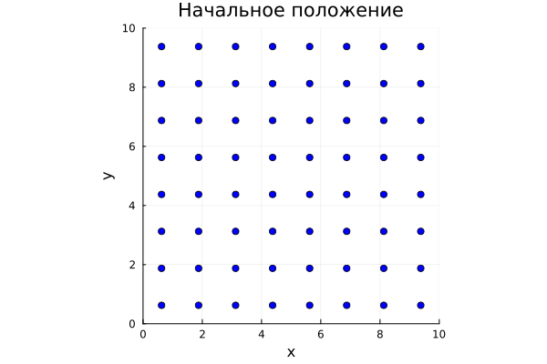
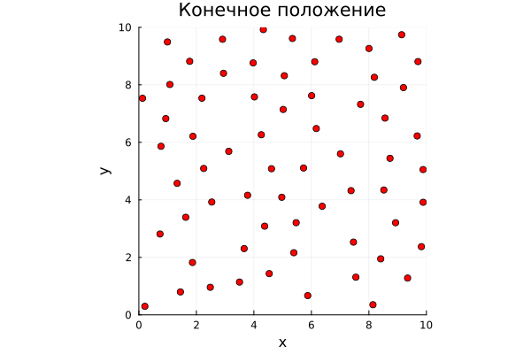
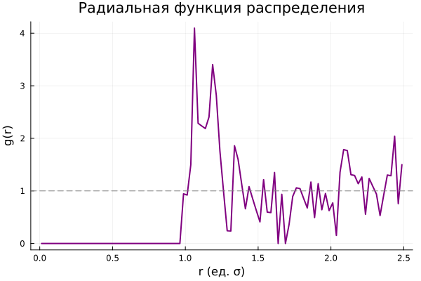
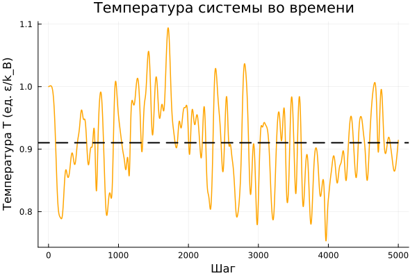

---
# Preamble

## Author
author: 
  name: Иванов С.В., Газизянов В.А., Жаворонков К.А., Кобзев Д.К., Базлов В.А, Седохин Д.А.

## Title
title: Молекулярная динамика
subtitle: Групповой проект. Этап 3
institute: Российский университет дружбы народов, Москва, Россия

license: CC BY
date: 2026-04-28

## Generic options
lang: ru-RU
crossref:
  lof-title: Список иллюстраций
  lot-title: Список таблиц
  lol-title: Листинги

## Fonts 
mainfont: PT Serif 
romanfont: PT Serif 
sansfont: PT Sans 
monofont: PT Mono 
mainfontoptions: Ligatures=TeX 
romanfontoptions: Ligatures=TeX 
sansfontoptions: Ligatures=TeX,Scale=MatchLowercase 
monofontoptions: Scale=MatchLowercase,Scale=0.9

## Formats
format:
### Pdf output format
  beamer:
    toc: false
    toc-title: Содержание
    number-sections: true
    colorlinks: false
    toc-depth: 2
    slide_level: 2
    aspectratio: 169
    section-titles: true
    theme: metropolis
    themeoptions: progressbar=frametitle,sectionpage=progressbar,numbering=fraction
    pdf-engine: xelatex
    fontenc: T2A
    incremental: false

#### Language
    babel-lang: russian
    babel-otherlangs: english

### Html output
  revealjs:
    transition: slide
    margin: 0.2
    smaller: false
    output-ext: html
    theme: beige
    logo: _resources/image/logo_rudn.png
---

## Программная реализация молекулярной динамики

- Иванов С.В.
- Газизянов В.А.
- Жаворонков К.А.
- Кобзев Д.К.
- Базлов В.А.
- Седохин Д.А.

Сегодня мы представим третий этап проекта — программную реализацию алгоритма молекулярной динамики.
Рассмотрим структуру кода, основные функции и полученные результаты.

## Цели третьего этапа

- Реализовать алгоритм молекулярной динамики на языке Julia
- Реализовать потенциал Леннарда-Джонса
- Реализовать метод Верле для интегрирования уравнений движения
- Добавить периодические граничные условия
- Исследовать зависимость кинетической и потенциальной энергии от времени
- Визуализировать траектории частиц и распределение скоростей

## Используемые инструменты

- Язык программирования: **Julia**
- Библиотеки:
  - `Plots.jl` — визуализация результатов
  - `LinearAlgebra` — векторные операции
  - `Statistics` — статистический анализ

## Задание базовых параметров

```julia
# Параметры системы
N = 64          # Количество частиц
L = 10.0        # Размер ячейки (Å)
dt = 0.001      # Шаг по времени (пс)
steps = 5000    # Количество шагов
T0 = 1.0        # Начальная температура (в ед. ε/k_B)
m = 1.0         # Масса частицы
rc = 2.5        # Радиус отсечения (в ед. σ)

# Параметры потенциала Леннарда-Джонса
ε = 1.0         # Глубина потенциальной ямы
σ = 1.0         # Характерное расстояние
```

## Инициализация системы

```julia
function initialize_positions(N, L)
    # Размещение частиц в узлах кубической решётки
    n_side = ceil(Int, N^(1/2))
    spacing = L / n_side
    positions = zeros(N, 2)
    for i in 1:N
        ix = (i-1) % n_side
        iy = (i-1) ÷ n_side
        positions[i, :] = [ix * spacing, iy * spacing]
    end
    return positions
end
```

## Инициализация системы

```julia
function initialize_velocities(N, T0, m)
    # Случайные скорости с нормировкой на температуру T0
    v = randn(N, 2)
    v .-= mean(v, dims=1)          # Обнуление суммарного импульса
    v .*= sqrt(T0 / mean(v.^2))    # Масштабирование под T0
    return v
end
```

## Потенциал Леннарда-Джонса

Потенциал взаимодействия между двумя частицами:

$$
U_{LJ}(r) = 4\varepsilon \left[ \left(\frac{\sigma}{r}\right)^{12} - \left(\frac{\sigma}{r}\right)^{6} \right]
$$

Сила, действующая на частицу:

$$
\vec{F} = -\nabla U_{LJ}(r) = \frac{24\varepsilon}{r^2}\left[2\left(\frac{\sigma}{r}\right)^{12} - \left(\frac{\sigma}{r}\right)^{6}\right]\vec{r}
$$

## Реализация потенциала Леннарда-Джонса

```julia
function lj_force(r_vec, ε, σ, rc)
    r = norm(r_vec)
    if r > rc
        return zeros(2), 0.0
    end
    sr6 = (σ / r)^6
    sr12 = sr6^2
    # Потенциальная энергия с поправкой на отсечение
    U = 4ε * (sr12 - sr6) - 4ε * ((σ/rc)^12 - (σ/rc)^6)
    # Сила
    F_mag = 24ε / r^2 * (2*sr12 - sr6)
    F_vec = F_mag .* r_vec
    return F_vec, U
end
```

## Вычисление сил в системе

```julia
function compute_forces(pos, N, L, ε, σ, rc)
    forces = zeros(N, 2)
    potential = 0.0
    for i in 1:N-1
        for j in i+1:N
            r_vec = pos[i,:] - pos[j,:]
            # Периодические граничные условия (минимальный образ)
            r_vec -= L .* round.(r_vec ./ L)
            F, U = lj_force(r_vec, ε, σ, rc)
            forces[i,:] += F
            forces[j,:] -= F
            potential += U
        end
    end
    return forces, potential
end
```

## Метод Верле (Velocity Verlet)

Обновление координат и скоростей на каждом шаге:

$$
\vec{r}(t+\Delta t) = \vec{r}(t) + \vec{v}(t)\Delta t + \frac{\vec{F}(t)}{2m}\Delta t^2
$$

$$
\vec{v}(t+\Delta t) = \vec{v}(t) + \frac{\vec{F}(t)+\vec{F}(t+\Delta t)}{2m}\Delta t
$$

## Метод Верле (Velocity Verlet)

```julia
function verlet_step!(pos, vel, forces, N, L, dt, m, ε, σ, rc)
    # Обновление координат
    pos .+= vel .* dt .+ (forces ./ (2m)) .* dt^2
    pos .= mod.(pos, L)                # Периодические условия
    # Силы на новом шаге
    forces_new, U = compute_forces(pos, N, L, ε, σ, rc)
    # Обновление скоростей
    vel .+= (forces .+ forces_new) ./ (2m) .* dt
    return forces_new, U
end
```

## Главный цикл моделирования

```julia
function simulate(N, L, dt, steps, T0, m, ε, σ, rc)
    pos = initialize_positions(N, L)
    vel = initialize_velocities(N, T0, m)
    forces, U = compute_forces(pos, N, L, ε, σ, rc)

    E_kin = zeros(steps)
    E_pot = zeros(steps)

    for step in 1:steps
        forces, U = verlet_step!(pos, vel, forces, N, L, dt, m, ε, σ, rc)
        Ek = 0.5m * sum(vel.^2)
        E_kin[step] = Ek
        E_pot[step] = U
    end
    return pos, vel, E_kin, E_pot
end
```

## Периодические граничные условия

- Частица, выходящая за границу ячейки, появляется с противоположной стороны
- Реализовано через операцию `mod`:
  ```julia
  pos .= mod.(pos, L)
  ```
- При расчёте расстояний используется **правило минимального образа**:
  ```julia
  r_vec -= L .* round.(r_vec ./ L)
  ```

## Результаты: Сохранение полной энергии

:::::::::::::: {.columns align=center}
::: {.column width="60%"}


:::
::: {.column width="40%"}

- Полная энергия $E = E_k + U$ сохраняется с точностью $\sim 10^{-4}$
- Флуктуации энергии подтверждают устойчивость метода Верле
- Начальный переходный процесс (~500 шагов) соответствует термализации

:::
::::::::::::::

## Результаты: Траектории частиц

:::::::::::::: {.columns align=center}
::: {.column width="50%"}



:::
::: {.column width="50%"}



:::
::::::::::::::

## Результаты: Распределение скоростей

:::::::::::::: {.columns align=center}
::: {.column width="60%"}


:::
::: {.column width="40%"}

Теоретическое распределение Максвелла:

$$
f(v) = 4\pi \left(\frac{m}{2\pi k_B T}\right)^{3/2} v^2 e^{-\frac{mv^2}{2k_BT}}
$$

Численное распределение хорошо согласуется с теорией.

:::
::::::::::::::

## Результаты: Радиальная функция распределения

:::::::::::::: {.columns align=center}
::: {.column width="55%"}



:::
::: {.column width="45%"}

Радиальная функция распределения:

$$
g(r) = \frac{V}{N^2} \left\langle \sum_{i \neq j} \delta(r - r_{ij}) \right\rangle
$$

- Первый пик соответствует ближайшим соседям
- При больших $r$ функция стремится к 1 (газообразное состояние)

:::
::::::::::::::

## Анализ температуры системы

```julia
function compute_temperature(vel, N, m)
    # Теорема о равнораспределении: <Ek> = (d/2) * N * k_B * T
    # В единицах k_B = 1, d = 2 (2D система)
    Ek = 0.5m * sum(vel.^2)
    T = Ek / N   # d=2, поэтому делим на N (а не 2N)
    return T
end
```

## Анализ температуры системы

:::::::::::::: {.columns align=center}
::: {.column width="50%"}



:::
::: {.column width="50%"}

- Температура стабилизируется после термализации
- Среднее значение соответствует заданной $T_0 = 1.0$
- Флуктуации $\sim 5\%$ для $N = 64$

:::
::::::::::::::

## Структура программного комплекса

Модули программы:

- `init.jl` — инициализация координат и скоростей
- `forces.jl` — вычисление потенциала Леннарда-Джонса и сил
- `integrator.jl` — метод Velocity Verlet
- `analysis.jl` — температура, энергия, $g(r)$, распределение скоростей
- `visualize.jl` — построение графиков
- `main.jl` — главный цикл, запуск моделирования

## Выводы

В ходе третьего этапа:

- Реализован комплекс программ молекулярной динамики на Julia
- Реализован потенциал Леннарда-Джонса с радиусом отсечения
- Применён метод Velocity Verlet — устойчивый и точный
- Добавлены периодические граничные условия

Результаты показывают:

- Полная энергия системы сохраняется с высокой точностью
- Распределение скоростей соответствует распределению Максвелла
- Радиальная функция распределения отражает газообразную структуру системы

**Дальнейшая работа:**  
На четвёртом этапе — защита проекта и коллективное обсуждение результатов.
