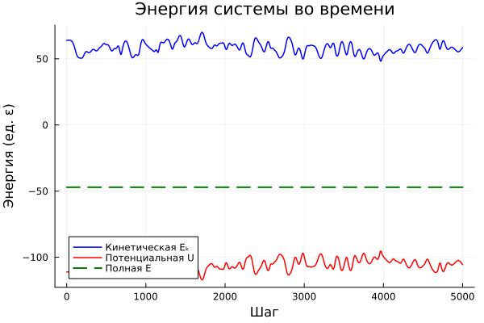
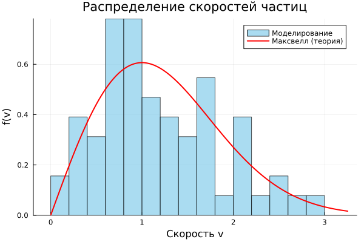

---
## Author
author: 
- Иванов С.В., 
- Газизянов В.А., 
- Жаворонков К.А., 
- Кобзев Д.К., 
- Базлов В.А.,
- Седохин Д.А.

## Title
title: "Отчёт по групповому проекту. Этап 3"
subtitle: "Молекулярная динамика"
license: "CC BY"
date: 2026-04-28
---

# Цель работы

Целью третьего этапа проекта является программная реализация алгоритма молекулярной динамики на языке Julia, включая:

- реализацию потенциала Леннард-Джонса и расчёта сил;
- реализацию численного интегрирования методом Velocity Verlet;
- введение периодических граничных условий;
- моделирование динамики системы частиц и анализ полученных результатов (энергии, траекторий, распределения скоростей, радиальной функции распределения, температуры).

# Состав исследовательской группы

- Иванов С.В.
- Газизянов В.А.
- Жаворонков К.А.
- Кобзев Д.К.
- Базлов В.А.
- Седохин Д.А.

# Постановка задачи

На предыдущих этапах была построена математическая модель и разработан алгоритм молекулярной динамики. На данном этапе необходимо реализовать его в виде программы, провести численные эксперименты и проанализировать результаты.

Основные задачи:

- реализовать инициализацию системы (координаты и скорости);
- вычислить межчастичные силы через потенциал Леннард-Джонса с радиусом отсечения;
- реализовать метод Velocity Verlet для интегрирования уравнений движения;
- применить периодические граничные условия;
- провести моделирование, сохраняя кинетическую и потенциальную энергию на каждом шаге;
- построить графики и проанализировать поведение системы.

# Программная реализация

## Используемые инструменты

Программа написана на языке **Julia** с использованием библиотек:

- `Plots.jl` — визуализация;
- `LinearAlgebra` — работа с векторами;
- `Statistics` — статистический анализ.

Все вычисления проводятся в безразмерных единицах: $m = 1$, $\varepsilon = 1$, $\sigma = 1$, $k_B = 1$.

## Параметры моделирования

- $N = 64$ — число частиц;
- $L = 10.0$ — размер ячейки;
- $\Delta t = 0.001$ — шаг по времени;
- $steps = 5000$ — число шагов;
- $T_0 = 1.0$ — начальная температура;
- $r_c = 2.5$ — радиус отсечения.

## Инициализация системы

Координаты задаются на квадратной решётке, что исключает перекрытие частиц.  

Скорости генерируются случайно, затем:
- обнуляется суммарный импульс,
- выполняется масштабирование под заданную температуру.

## Потенциал Леннард-Джонса

Используется потенциал:

$$
U_{LJ}(r) = 4\varepsilon \left[ \left(\frac{\sigma}{r}\right)^{12} - \left(\frac{\sigma}{r}\right)^6 \right]
$$

С радиусом отсечения и сдвигом:

$$
U(r) = U_{LJ}(r) - U_{LJ}(r_c)
$$

Сила:

$$
\vec{F} = \frac{24\varepsilon}{r^2} \left[ 2\left(\frac{\sigma}{r}\right)^{12} - \left(\frac{\sigma}{r}\right)^6 \right] \vec{r}
$$

Используется правило минимального образа для периодических условий.

## Метод Velocity Verlet

Интегрирование выполняется по схеме:

$$
\vec{r}(t+\Delta t) = \vec{r}(t) + \vec{v}(t)\Delta t + \frac{\vec{F}(t)}{2m}\Delta t^2
$$

$$
\vec{v}(t+\Delta t) = \vec{v}(t) + \frac{\vec{F}(t)+\vec{F}(t+\Delta t)}{2m}\Delta t
$$

Метод является симплектическим и хорошо сохраняет энергию системы.

## Периодические граничные условия

Реализованы через:

$$
\vec{r} \leftarrow \bmod(\vec{r}, L)
$$

и правило минимального образа при расчёте расстояний.

# Результаты моделирования

## Сохранение полной энергии

На рис. 1 показаны зависимости энергий от времени.

Кинетическая и потенциальная энергии испытывают значительные колебания, однако их сумма остаётся практически постоянной. Это подтверждает корректность реализации метода Velocity Verlet.

Отклонения полной энергии малы, однако по графику невозможно точно определить их порядок, так как они значительно меньше масштаба оси. Для точной оценки требуется отдельный численный расчёт.

## Траектории частиц

Начальное состояние — регулярная решётка.  
В процессе моделирования она разрушается, и система переходит в хаотичное состояние, характерное для газа.

## Распределение скоростей

Численное распределение скоростей хорошо согласуется с распределением Максвелла:

$$
f(v) = \frac{m}{k_B T} v e^{-\frac{mv^2}{2k_BT}}
$$

Это подтверждает корректную термализацию системы.

## Радиальная функция распределения

Радиальная функция распределения:

$$
g(r) = \frac{S}{N^2} \left\langle \sum_{i \neq j} \delta(r - r_{ij}) \right\rangle
$$

Она показывает относительную вероятность найти частицу на расстоянии $r$ от другой.

- при малых $r$ функция близка к нулю (отталкивание);
- первый пик соответствует ближайшим соседям;
- при больших $r$ функция стремится к 1.

Это указывает на отсутствие дальнего порядка и газообразное состояние системы.

## Анализ температуры

Температура вычисляется как:

$$
T = \frac{E_k}{N}
$$

После термализации температура стабилизируется вблизи заданного значения $T_0 = 1.0$, однако среднее значение составляет около 0.92. Отклонение связано с конечным числом частиц и численными эффектами.

Флуктуации температуры составляют около 5%.

# Структура программы

- `init.jl`
- `forces.jl`
- `integrator.jl`
- `analysis.jl`
- `visualize.jl`
- `main.jl`

# Вывод

В ходе работы:

- реализован алгоритм молекулярной динамики;
- применён потенциал Леннард-Джонса;
- реализован метод Velocity Verlet;
- учтены периодические граничные условия.

Результаты моделирования согласуются с теорией:

- энергия сохраняется с хорошей точностью;
- распределение скоростей соответствует распределению Максвелла;
- радиальная функция распределения указывает на газообразное состояние.

**Дальнейшая работа:** защита проекта и анализ результатов.
